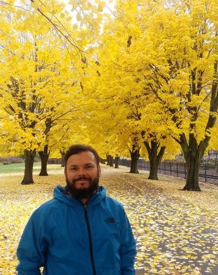

### [**$\leftarrow$ Home**](https://pegutierrezf.github.io/TropicalFreshwaterEcology/) 
 

### _Pablo Gutierrez_
 

 
 
Department of Biology &  
Center for Research in Marine Science and Limnology  
University of Costa Rica  
 
<pabloe.gutierrezfonseca@gmail.com> 

[Twitter](https://twitter.com/pabloguticr)  
[GitHub](https://github.com/PEGutierrezF)  
[Google Scholar](https://scholar.google.com.pr/citations?user=wuimcbkAAAAJ&hl=en&authuser=1)

<a itemprop="sameAs" content="https://orcid.org/0000-0003-0777-8889" href="https://orcid.org/0000-0003-0777-8889" target="orcid.widget" rel="me noopener noreferrer" style="vertical-align:top;">https://orcid.org/0000-0003-0777-8889</a>

[Research Gate](https://www.researchgate.net/profile/Pablo_Gutierrez-Fonseca2) 
 
 
 
